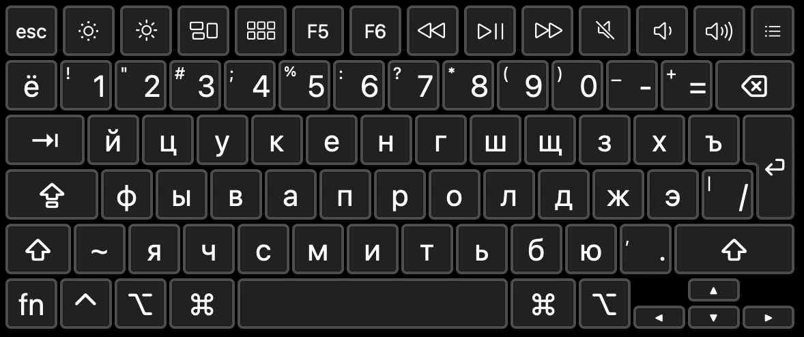
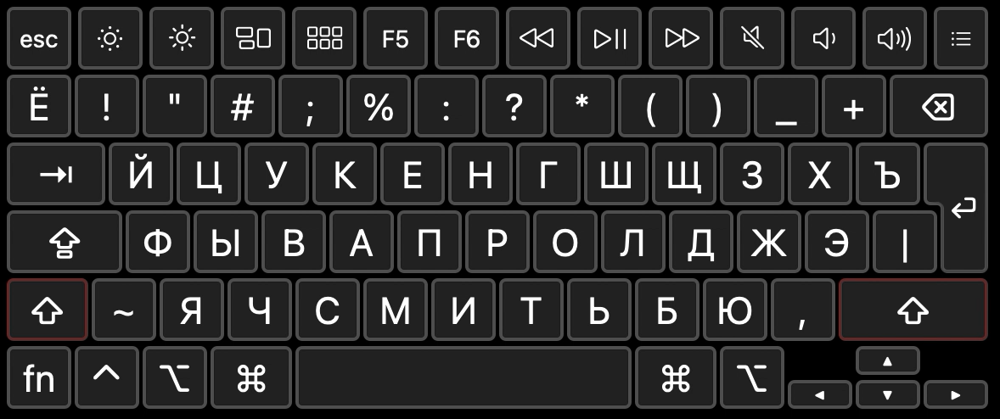
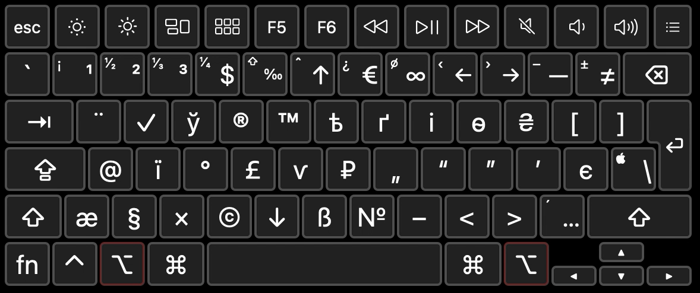
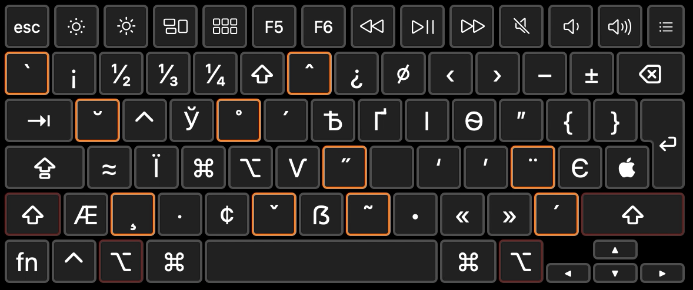
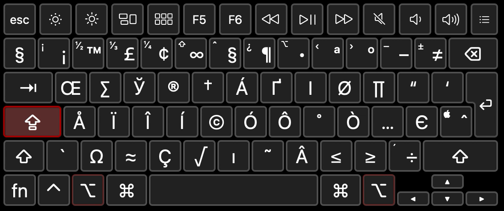
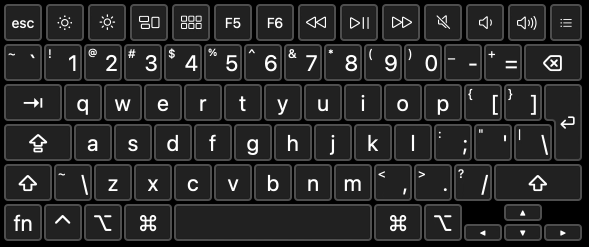
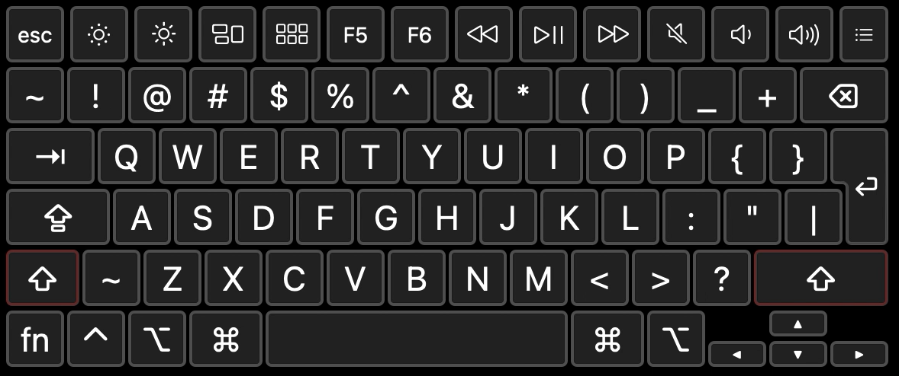
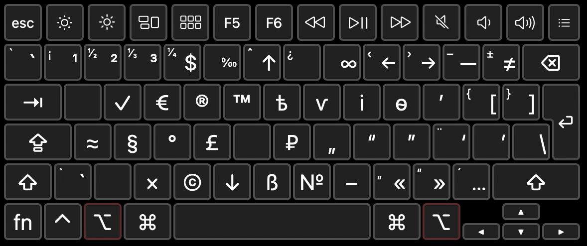
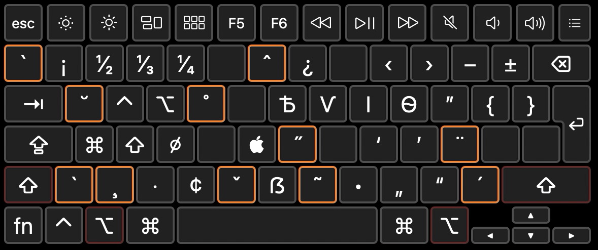
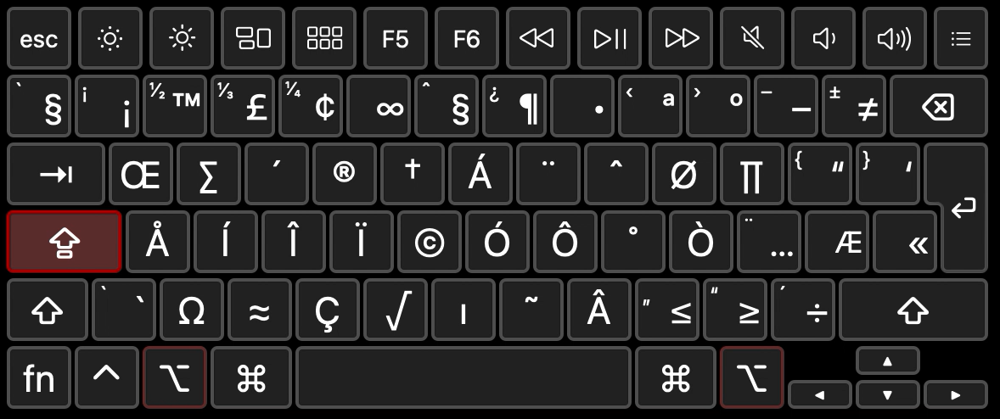

# keyboardlayout
Modified version of [Ilya Birman's Typography Layout](https://ilyabirman.ru/type) with Ukrainian letters and some small things

## Installation
### macOS
1. Head to [releases](https://github.com/gershik/keyboardlayout/releases) and download the latest .dmg installer
2. Run `Keyboard Installer.app`
3. Drag `Gershik's kbd.bundle` to the Keyboard Installer's window
4. Choose your method of installation
5. Log out from your session and log back in
6. Go to System Preferences -> Keyboard -> Input Sources
7. Add English - Gershik, Russian - Gershik (optional) and Japansese - Kana
8. Remove ABC and any other English/Russian layouts that you don't need anymore
9. Remover Japanese - Kana
10. Done!

### Windows
Coming soon...

## Screenshots
### Russian

### English

## Credits
* Ilya Birman for his [original keyboard layout](https://ilyabirman.ru/type)
* SIL for [Ukelele](https://software.sil.org/ukelele/), the software used to create these things on macOS