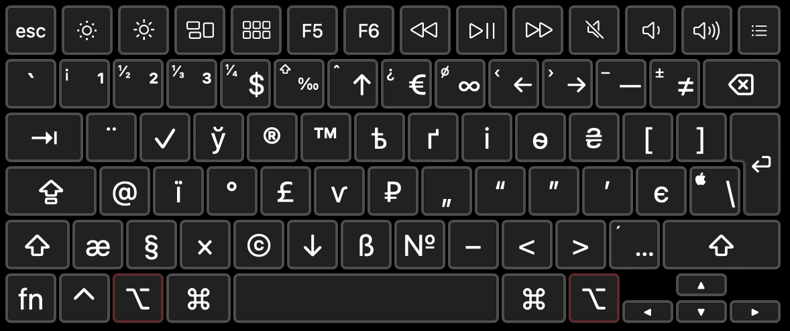
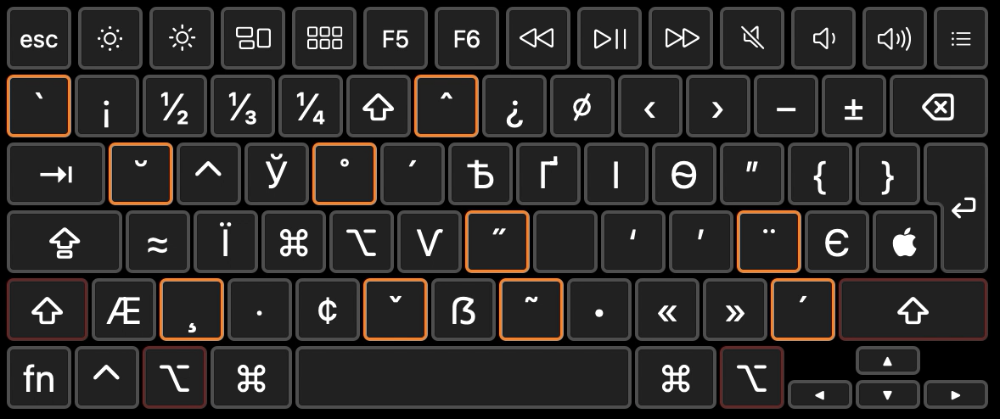
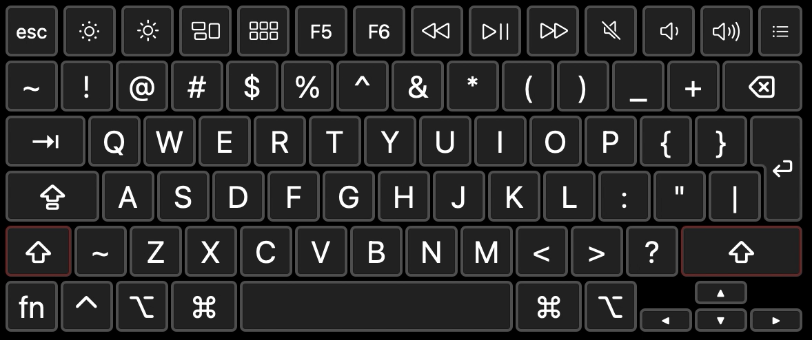
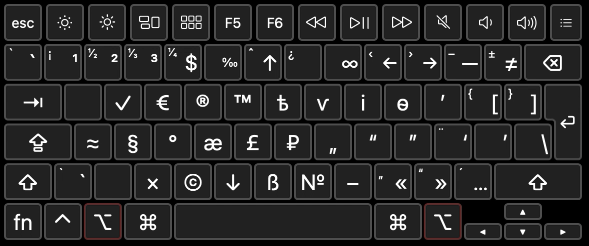
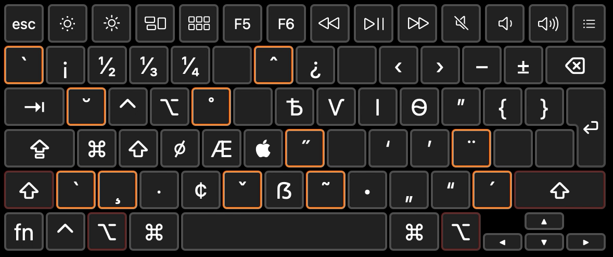

# What is this?

This is a modified version of [Ilya Birman's Typography Layout](https://ilyabirman.ru/type). It replaces your system keyboard layouts, so you can type special characters right from your keyboard. 
=======
title: gershik's modified keyboard layout
permalink: /english/
---
# keyboardlayout
Modified version of [Ilya Birman's Typography Layout](https://ilyabirman.ru/type) with Ukrainian letters and some small things
>>>>>>> 4cd1568b34a0fc5b48708105b51f15b6af6783b1

## Installation
### macOS
1. Head to [releases](https://github.com/gershik/keyboardlayout/releases) and download the latest .dmg installer
2. Run `Keyboard Installer.app`
3. Drag `Gershik's kbd.bundle` to the Keyboard Installer's window
4. Choose your method of installation
5. Log out from your session and log back in
6. Go to System Preferences -> Keyboard -> Input Sources
7. Add English - Gershik, Russian - Gershik (optional) and Japansese - Kana
8. Remove ABC and any other English/Russian layouts that you don't need anymore
9. Remover Japanese - Kana
10. Done!

### Windows
1. Head to [releases](https://github.com/gershik/keyboardlayout/releases) and download the latest Windows zip file
2. Extract the archive and run `setup.exe` in each language's folder
3. Log out from your session and log back in
4. Go to Settings -> Time & Language -> Language
5. Delete the unwanted system layouts
6. Done!

<<<<<<< HEAD
## Screenshots
### Russian

### English

## Credits
* Ilya Birman for his [original keyboard layout](https://ilyabirman.ru/type)
* SIL for [Ukelele](https://software.sil.org/ukelele/), the software used to create these things on macOS
=======
## Credits
* Ilya Birman for his [original keyboard layout](https://ilyabirman.ru/type)
* SIL for [Ukelele](https://software.sil.org/ukelele/), the software used to create these things on macOS
>>>>>>> 4cd1568b34a0fc5b48708105b51f15b6af6783b1
